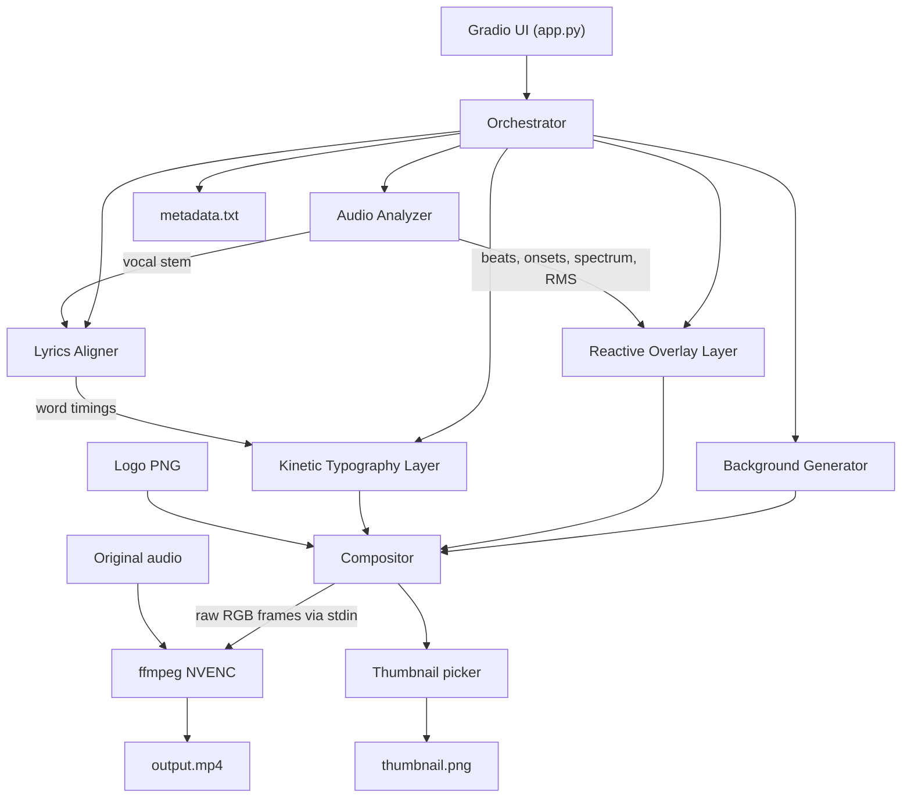

# Product Requirements Document — "Glitchframe" Local Video Generator

Version: 0.1 (draft)
Owner: Single-operator / personal tool
Target hardware: Windows 10/11, NVIDIA RTX 3090 (24 GB VRAM)

---

## 1. Goal

A single-operator local tool (Gradio UI in the browser, runs 100% locally on an RTX 3090) that turns a song + metadata + optional lyrics into a YouTube-ready music video.

Inputs:

- An audio file (MP3 / WAV / FLAC)
- Song metadata (artist, title, album, year, genre)
- A logo PNG (optional, transparent background)
- Lyrics text (optional, one line per lyric line)
- A style/mood selection (preset + optional custom prompt)

Outputs (written to `outputs/<run_id>/`):

- `output.mp4` — 1080p, 30 fps, H.264 NVENC, original audio muxed in
- `thumbnail.png` — 1920×1080 cover frame
- `metadata.txt` — suggested YouTube title, description (with chapter timestamps if detected), tags

Target render time: **under 3× song length** end-to-end on the 3090 (e.g. a 3-minute song in under 9 minutes), dominated by AI background generation. Non-AI reactive-only renders should run faster than real-time.

---

## 2. High-level architecture



---

## 3. Functional requirements

### 3.1 GUI (Gradio)

Single-page layout, sections:

- **Audio**: file upload, waveform preview, play/scrub.
- **Metadata**: artist, title, album, year, genre, BPM (auto-filled after analyze, editable).
- **Branding**: logo upload, logo position (4 corners / center), logo opacity slider.
- **Lyrics**: large textarea (paste raw lyrics, one line per lyric line), checkbox "Enable kinetic typography".
- **Visual style**:
  - Preset dropdown: `neon-synthwave`, `minimal-mono`, `organic-liquid`, `glitch-vhs`, `cosmic`, `lofi-warm` (each preset bundles SD prompt, shader, typography style, color palette).
  - "Custom prompt" text field (overrides preset's SD prompt).
  - Background mode: `AI stills (fast)`, `AI animated (AnimateDiff, slow)`, `Static image upload`.
  - Reactive intensity slider (0–100%).
- **Output**: resolution (1080p default, 4K optional), fps (30/60), filename prefix.
- **Actions**:
  - `Analyze` — quick (~10 s): runs audio analyzer only, populates BPM, waveform.
  - `Preview 10 s` — renders a 10 s sample from the loudest / chorus section.
  - `Render full video` — the main action.
- **Progress panel**: per-stage progress bars, live ETA, scrolling log tail.

### 3.2 Audio analysis pipeline

- Load via `soundfile` / `librosa` at 44.1 kHz mono mixdown for analysis (keep stereo original for mux).
- **Tempo + beat grid**: `BeatNet` (preferred, ML-based, accurate on modern music) with `madmom` fallback.
- **Onset detection**: `librosa.onset.onset_strength` → peaks for drum hits.
- **Spectral bands**: 8-band log-mel energy per frame at target fps (30/60 Hz) feeding the reactive shader.
- **RMS / loudness envelope** for global pulsing.
- **Vocal separation**: `demucs` (htdemucs_ft model) → `vocals.wav` used by the aligner and for vocal-reactive FX.
- **Structural segmentation** (`librosa.segment`) → section boundaries for chapters and background keyframe planning.
- **Key/chord detection** (stretch): drives color palette shifts.

Results cached as `cache/<song_hash>/analysis.json` + stem WAVs so re-renders skip analysis.

### 3.3 Lyrics alignment

- Input: user-pasted lyrics (plain text) + `vocals.wav`.
- `WhisperX` (large-v3) with word-level timestamps on the vocal stem.
- Alignment: map pasted lyrics to WhisperX word tokens via Needleman–Wunsch / DTW on normalized text, carrying timestamps across so the user's exact spelling/punctuation is preserved.
- Output: list of `{word, line_idx, t_start, t_end}` in `cache/<song_hash>/lyrics.aligned.json`.
- Manual correction pass in UI (stretch): timeline view, drag to shift.

### 3.4 Background generator

- **AI stills mode (default)**: generate `N = ceil(duration / 8 s)` SDXL keyframes using the preset prompt + custom prompt, interpolate between them with `FILM` or simple crossfades synced to section boundaries. Each image 1920×1080, upscaled if needed. Runs in `diffusers` pipeline with FP16 on the 3090.
- **AnimateDiff mode**: short motion loops (~2 s) generated per section, looped/crossfaded. Heavier VRAM/time but true motion.
- **Static image mode**: use uploaded image with subtle Ken-Burns + parallax based on RMS envelope.

Results cached in `cache/<song_hash>/background/`.

### 3.5 Reactive overlay layer

- GPU shader pass via `moderngl` (OpenGL, offscreen FBO) — draws on top of the background frame.
- Uniforms per frame: `time`, `beat_phase`, `band_energies[8]`, `rms`, `onset_pulse`.
- Shader library in `assets/shaders/`: spectrum rings, particle field, geometry pulses, liquid flow, glitch RGB-split. Preset picks one + tuning.
- Rendered at target resolution, alpha-composited onto background.

### 3.6 Kinetic typography layer

- Rendered with `skia-python` (fast, high-quality text with shadows / strokes / gradients).
- Driven by `lyrics.aligned.json`.
- Per-word motion presets: `pop-in`, `beat-shake`, `scale-pulse`, `slide`, `flicker`.
- Line layout: centered lower-third by default, auto-resize to fit safe area, previous line fades as next starts.
- Font: bundled open-license display fonts per preset (e.g. Inter, Bebas Neue, Syne, Space Mono).
- Rendered as RGBA at target resolution, composited on top of the reactive layer.

### 3.7 Compositor & encoder

- Frame loop runs at target fps. For each frame index:
  1. Pull/interpolate background RGB frame.
  2. Blend reactive RGBA.
  3. Blend typography RGBA.
  4. Blend logo RGBA (fixed).
  5. Write raw BGR to `ffmpeg` stdin.
- `ffmpeg` command:
  ```
  ffmpeg -f rawvideo -pix_fmt bgr24 -s WxH -r FPS -i - \
         -i <audio> \
         -c:v h264_nvenc -preset p5 -rc vbr -cq 19 -b:v 12M \
         -c:a aac -b:a 192k -shortest output.mp4
  ```
- Parallelism: background gen, reactive render, and typography render can each run on separate CUDA streams; frame pipeline uses a bounded queue so the encoder never starves.

### 3.8 Thumbnail & metadata

- **Thumbnail**: pick the frame at the first chorus downbeat (or loudest 1-s window), overlay a big-text treatment of `Artist — Title` using the same typography preset. Save as `thumbnail.png` 1920×1080.
- **metadata.txt**:
  - Title: `{Artist} — {Title} [Official Visualizer]`
  - Description: song info + optional lyric block + "Generated with Glitchframe" line.
  - Tags: genre, artist, title, "music visualizer", plus tags derived from preset.
  - Chapters (if instrumental sections detected): `00:00 Intro`, `00:32 Verse 1`, etc.

---

## 4. Tech stack

- **Language**: Python 3.11
- **GPU runtime**: CUDA 12.x, PyTorch 2.x (FP16/BF16)
- **Audio**: `librosa`, `soundfile`, `BeatNet` (or `madmom`), `demucs`, `whisperx`
- **Diffusion**: `diffusers`, SDXL base+refiner, optionally AnimateDiff
- **Graphics**: `moderngl` (shaders), `skia-python` (typography), `Pillow` / `numpy` (utility)
- **UI**: `gradio` 4.x
- **Encoding**: system `ffmpeg` with NVENC (`h264_nvenc`)
- **Packaging**: `uv` or `pip` + `requirements.txt`; `.env` for model cache paths

---

## 5. Project layout

```
glitchframe/
├── app.py                  # Gradio entrypoint
├── config.py               # Defaults, paths, preset registry
├── orchestrator.py         # Pipeline coordinator
├── pipeline/
│   ├── audio_analyzer.py
│   ├── lyrics_aligner.py
│   ├── background_gen.py
│   ├── reactive_layer.py
│   ├── lyric_layer.py
│   ├── compositor.py
│   ├── thumbnail.py
│   ├── metadata.py
│   └── renderer.py
├── presets/
│   ├── neon-synthwave.yaml
│   ├── minimal-mono.yaml
│   └── ...
├── assets/
│   ├── shaders/
│   └── fonts/
├── cache/                  # analysis + stems + backgrounds (per-song hash)
├── outputs/                # MP4 + PNG + TXT per run
├── requirements.txt
└── README.md
```

---

## 6. Milestones (phased build)

- **M1 — Skeleton + audio analysis**: Gradio shell, upload, BeatNet + spectrum + RMS, render a plain 1080p video with a simple spectrum visualizer overlaid on a solid color, ffmpeg NVENC piping, audio muxed in. Proves the render pipeline end-to-end.
- **M2 — Reactive shader layer**: `moderngl` offscreen rendering, 2–3 shaders, preset YAMLs, logo compositing, thumbnail + metadata generation.
- **M3 — Lyrics alignment + typography**: Demucs + WhisperX + alignment, Skia typography layer with 3 motion presets.
- **M4 — AI background (stills)**: SDXL integration, keyframe prompt planning from song sections, interpolation, caching.
- **M5 — Polish**: AnimateDiff mode (optional), 4K support, preview-10s fast path, preset library expansion, error handling + resumable renders.

Each milestone produces a usable tool; scope can stop at any milestone if priorities shift.

---

## 7. Open risks / decisions to revisit

- **WhisperX vs NeMo Forced Aligner**: WhisperX is simpler; if alignment quality on sung vocals is poor, fall back to aeneas or MFA with a phoneme model.
- **AnimateDiff VRAM**: may require tiled / low-res generate + upscale on the 3090 at 1080p; easier to generate at 720p and upscale.
- **Font licensing**: ship only open-license fonts; provide a "use system font" option.
- **Gradio + long renders**: use background jobs + polling; Gradio's queue handles this, but we must stream progress correctly.
- **Audio/video drift**: NVENC piping must honor `-r` exactly; validate with `ffprobe` after each render.
- **First-run model downloads**: SDXL + Whisper large-v3 + Demucs together ≈ 20+ GB on disk; document this clearly in README.

---

## 8. Non-goals (v1)

- No automatic upload to YouTube (explicitly out of scope; metadata file only).
- No multi-song batch queue in v1 (easy to add later).
- No cloud rendering; 100% local on the 3090.
- No stem-based remixing of the song itself.
- No mobile / vertical (Shorts) aspect ratio in v1 — 16:9 only.
