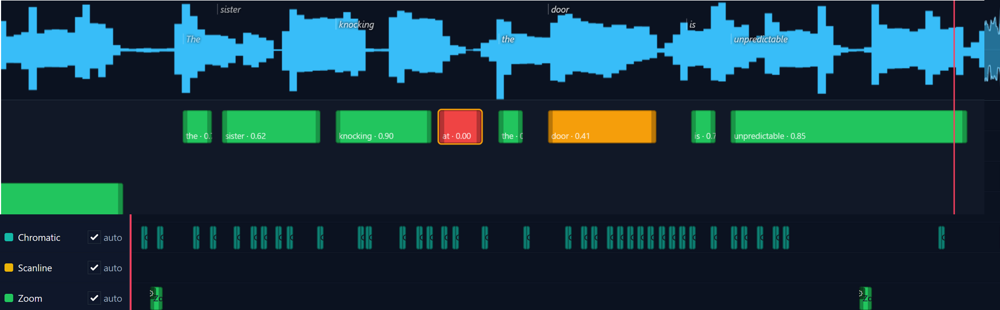
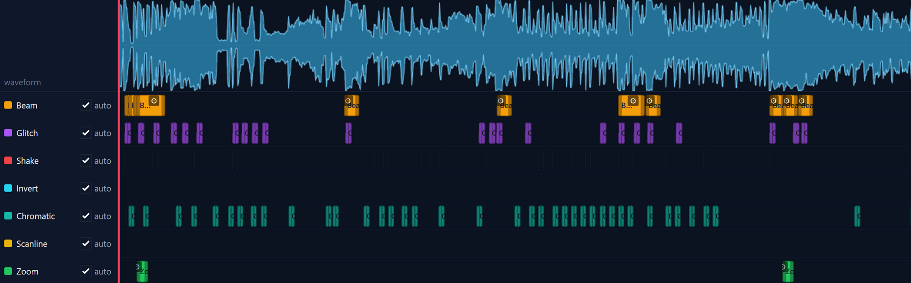

# Glitchframe

Local, GPU-accelerated **music video** generator: upload a track, analyze it, align lyrics, generate stylized backgrounds, composite reactive shaders and kinetic type, and encode with **ffmpeg** (NVENC on NVIDIA GPUs by default).

**Examples (progress log, newest = current state):** [voidcat on YouTube](https://www.youtube.com/@voidcatalog)

- **UI:** [Gradio](https://www.gradio.app/) — run `python -m app` and open the URL shown (default [http://127.0.0.1:7860](http://127.0.0.1:7860)).
- **New to the command line or on Windows?** Start with **[Getting started on Windows](docs/guides/getting-started-windows.md)** (order of installs: Python, optional Git, ffmpeg with winget, then the project).
- **Deep dive:** [`docs/index.md`](docs/index.md) and [`docs/technical/project-setup-and-config.md`](docs/technical/project-setup-and-config.md).

**License:** [MIT](LICENSE) · **Repository:** [github.com/OlaProeis/Glitchframe](https://github.com/OlaProeis/Glitchframe)

## Features (overview)

- **Ingest and analysis:** Per-song cache, waveform preview, beat/onset/spectrum features, optional **Demucs** vocal stem, segment/chapter hints.
- **Lyrics:** **WhisperX** word timings plus alignment to pasted lyrics; visual per-word **timeline editor** for fixes (saved to cache so re-runs do not clobber your edits).
- **Backgrounds:** **SDXL** keyframe stills, **Ken Burns** on stills, optional **AnimateDiff** motion (VRAM-heavy; see *Known limitations*).
- **Look and motion:** GLSL **reactive shaders** (audio-reactive passes), **Skia** kinetic typography, title/thumbnail text, optional **logo** placement with rim glow, beams, and branding-driven effects.
- **Effects timeline:** Per-clip post effects (e.g. screen shake, chromatic aberration, colour invert, zoom punch, scanline tear) with an in-UI editor and baked JSON under the song cache.
- **Output:** Full-length render and **10 s preview** (loudest window), `output.mp4` + `thumbnail.png` + YouTube-oriented **`metadata.txt`**, with NVENC by default when available.

## Screenshots

**Lyrics timeline** (per-word alignment and editing on the vocal waveform):



**Effects timeline** (clip-based post effects with rows, playhead, and per-clip controls):



## Known limitations (read before you depend on it)

- **Vocal / lyrics matching** can be **unreliable** in places. Treat alignment as a draft: use the lyrics timeline and listen back **before** you commit time to a full render. Improving this area is a priority; do not assume perfect lip-sync or line timing yet.
- **Rendering is effectively single-threaded** for the heavy pipeline. Full videos often take **on the order of 1–2+ hours** (sometimes more), depending on preset, length, resolution, and GPU. Plan batch work accordingly.
- **AnimateDiff “loops” (default in relevant presets)** is **very VRAM-hungry**: plan for **about 20 GB VRAM** on the GPU. With less memory, expect **extreme slowness, swapping, or failed runs**. Prefer SDXL stills or Ken Burns if you are VRAM-limited.
- The app is under active development; UI labels and edge cases are still being hardened.

## Future (from project backlog)

The following is a short, user-facing summary of work **not yet done** (also tracked in Taskmaster as `pending` / `deferred` in [`.taskmaster/tasks/tasks.json`](.taskmaster/tasks/tasks.json)):

- **Unify “auto” effects with the timeline** — one control surface: analyser-driven glitch, beams, and related FX should not stack with the Effects timeline in confusing ways; timeline becomes authoritative where intended (*pending*).
- **Faster preview backgrounds** — generate SDXL/AnimateDiff/Ken Burns assets only for the 10 s preview window (plus padding), then fill the rest on full render, with clearer cache keys so preview is much cheaper than today (*deferred*).
- **Bass-driven logo pulse** — optional mode where logo motion follows low-frequency energy / kicks instead of a generic beat grid, with tunable sensitivity (*deferred*).
- **Overnight / multi-song queue** — batch several full renders (CLI or Gradio) with stable paths and isolated failures (*deferred*).
- **Single primary “export” affordance** — one obvious control that runs the full pipeline, while keeping optional Analyze/Align as precache steps (*deferred*).
- **Timestamped section headers in lyrics** — lines like `[Verse 1 0:12]` or `[Chorus 1:00]` that set both a section break and a coarse time anchor, to reduce manual `[m:ss]` busywork (*deferred*).

## Requirements

- **Python** 3.11+ (3.12/3.13 may work; optional deps like `madmom` are pickier on newer Python)
- **ffmpeg** on your `PATH` (encode/mux). On **Windows**, install with **winget** (see [Getting started on Windows](docs/guides/getting-started-windows.md)); on other systems use your package manager or [ffmpeg.org](https://ffmpeg.org/download.html) if needed
- **NVIDIA GPU + CUDA 12.x** recommended for diffusers, analysis, and NVENC; CPU-only is possible for lighter paths but not the main focus
- **Disk:** model and song caches under `.cache/` and `cache/` (large downloads on first use)

## Install

**Windows, step-by-step (what to install first, PowerShell, ZIP vs git):** [docs/guides/getting-started-windows.md](docs/guides/getting-started-windows.md).

The short version below matches that guide; on Windows prefer **`py -3.11`** if `python` is not on your `PATH`.

### 1. Get the project and create a virtualenv

**With git:**

```bash
git clone https://github.com/OlaProeis/Glitchframe.git
cd Glitchframe
python -m venv .venv
```

**Without git:** from the [GitHub](https://github.com/OlaProeis/Glitchframe) repo, **Code → Download ZIP**, extract, `cd` into the folder, then `python -m venv .venv` (or `py -3.11 -m venv .venv` on Windows).

Then activate the venv:

- **Windows (cmd):** `.venv\Scripts\activate.bat`
- **Windows (PowerShell):** `.venv\Scripts\Activate.ps1`
- **macOS / Linux:** `source .venv/bin/activate`

### 2. PyTorch with CUDA (recommended)

Install PyTorch **first** from the official CUDA 12.4 wheel index so you get a GPU build (adjust if you use a different CUDA index from [pytorch.org](https://pytorch.org/)):

```bash
python -m pip install --upgrade pip
python -m pip install torch torchvision torchaudio --index-url https://download.pytorch.org/whl/cu124
```

On Windows, if `python` is not on `PATH`, use the launcher: `py -3.11 -m pip ...`.

### 3. Project dependencies

```bash
python -m pip install -r requirements.txt
python -m pip install -e .
```

`requirements.txt` pins a few Gradio-related packages; see the comments at the top of that file if `pip` pulls incompatible versions.

### 4. Optional: full analysis + lyrics stack

For vocal stem separation (Demucs) and lyrics alignment (WhisperX + Silero VAD):

```bash
python -m pip install -e ".[all]"
```

If after installing `whisperx` CUDA **disappears** from PyTorch, reinstall the CUDA wheels from the same `cu124` index as in step 2, then re-pin Gradio’s friends if needed — recovery commands are in [`requirements.txt`](requirements.txt) comments.

**Optional beat detectors** (BeatNet + madmom) are available via `pip install -e ".[beats]"` but can be finicky to build; the analyzer falls back to librosa without them.

### 5. Optional: environment overrides

```bash
copy .env.example .env
```

On Unix: `cp .env.example .env` — then edit `.env` if you need custom **`GLITCHFRAME_*`** paths or ffmpeg codec overrides. Legacy **`MUSICVIDS_*`** names are still read for the same settings. The sample file also lists optional API keys for **Taskmaster** / dev tooling, not for core Glitchframe.

## Run

```bash
python -m app
```

Open the local URL printed in the console (default port **7860**).

## Pinokio

This repository includes [Pinokio](https://pinokio.co/) scripts (`install.js`, `start.js`, `reset.js`, `update.js`, `pinokio.js`, `icon.png`) so you can install and launch from the Pinokio app via **Download from URL** (paste the Git URL). The installer runs `pip` in a virtualenv named **`env`** (Python **3.11**): PyTorch from the **CUDA 12.4** wheel index, then `requirements.txt`, `pip install -e .`, and `pip install -e ".[all]"` (Demucs, WhisperX, etc.) &mdash; one install flow with visible `pip` output. After install, **click Start** in Pinokio&rsquo;s sidebar (Pinokio does not auto-launch the Gradio server). You still need **ffmpeg** on your `PATH` and a capable **NVIDIA + CUDA** stack. For discovery, add the GitHub topic **`pinokio`**.

## Troubleshooting

- **Step-by-step (Windows, after PyTorch / lyrics issues):** [docs/technical/windows-venv-recovery-guide.md](docs/technical/windows-venv-recovery-guide.md) — `git pull`, clean `torch`/`torchvision`/`torchaudio` reinstall, extras, test **Align lyrics**.
- **Align lyrics** fails with `Weights only load failed` / `omegaconf` / `ListConfig`: PyTorch **2.6+** defaults `torch.load` to a stricter mode that breaks some WhisperX/pyannote checkpoints. **Prefer updating Glitchframe** to a revision that includes `pipeline/torch_checkpoint_compat.py` and keeping a **current** `torch` / `torchvision` / `torchaudio` trio from the same CUDA index ([Install §2](#2-pytorch-with-cuda-recommended)). Downgrading only `torch` to “fix” this often causes the cuDNN mismatch below.
- **`Could not load library cudnn_ops_infer64_8.dll` / `Could not locate cudnn_ops_infer64_8.dll` / error `1920`:** Glitchframe forces **Silero** VAD for WhisperX on **Windows** (Pyannote VAD hits this DLL with PyTorch cu124). Use a current `git pull` and ``GLITCHFRAME_WHISPERX_VAD_METHOD`` / ``.env.example`` if you need to override. Separately, the faster-whisper stack can still expect **cuDNN 8**-named DLLs in other code paths. Newer PyTorch wheels may ship **`cudnn_ops_infer64_9.dll`** only, or a partial reinstall left mismatched packages. **On Windows, `pip install -e ".[all]"` already pins `ctranslate2==4.4.0`** in `pyproject.toml` (Extras `all` / `lyrics` / `analysis`) to avoid a common case; re-run that install in your venv if you set the env up before that pin. **If it still fails, try in order:** (1) Reinstall a **matching trio** in one go: `python -m pip uninstall torch torchvision torchaudio` then `python -m pip install torch torchvision torchaudio --index-url https://download.pytorch.org/whl/cu124` (use the same index you rely on for CUDA), then `python -m pip install -e ".[all]"` again. (2) `python -m pip install "ctranslate2==4.4.0"` (see [whisperX#899](https://github.com/m-bain/whisperX/issues/899)). (3) Copy the `bin` DLLs from [NVIDIA cuDNN 8.9.x for CUDA 12](https://developer.nvidia.com/rdp/cudnn-archive) into your venv’s `Lib\site-packages\torch\lib` (or the `ctranslate2` package folder) — last resort. Long term, **avoid** mixing an old `torch` with a newer `torchaudio` / `whisperx`.

## Development

- Smoke test config/presets: `python config.py`
- Tests (after `pip install -e ".[dev]"`): `pytest`
- In this repo, `uv sync` / `uv run pytest` is also used; see `ai-context.md` for maintainer notes.

**AI-assisted development:** Much of this codebase was built with AI coding assistants and planning tools (the same day-to-day workflow as the [Ferrite](https://github.com/OlaProeis/Ferrite) project). For a concrete write-up of that process—context files, handover notes, and how tasks and reviews are organized—see Ferrite’s [AI development workflow](https://github.com/OlaProeis/Ferrite/blob/master/docs/ai-workflow/ai-development-workflow.md).

## Contributing

Issues and pull requests are welcome. Please keep changes focused; match existing style in the files you touch.

## Legal

This project is licensed under the [MIT License](LICENSE). Third-party assets (e.g. fonts under `assets/fonts/`) carry their own license files where applicable.
